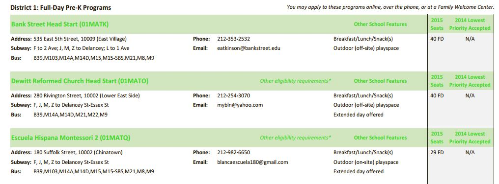

# Introduction

A hallmark of mayoral administration of NYC Mayor Bill DeBlasio has been free pre-K for all New York families.  When the program was initially rolled out there were [complaints in some quarters that upper-income neighborhoods were getting more slots]( http://www.theatlantic.com/education/archive/2015/02/a-tale-of-two-pre-ks/385997/).

This is an exploration comparing income to pre-K seats by neighborhoods. It was done mainly to help me practice with the whole workflow of data gathering, document parsing, and data tidying - plus making cool bi-variate choropleth maps! I had to invent a novel method in R to get a good looking bivariate legend onto the chart.

Thanks to Joshua Stevens for the inspiration and color theory of bi-variate maps (http://www.joshuastevens.net/cartography/make-a-bivariate-choropleth-map/). Thanks to Ari Lamstein for the awesome suite of choropleth packages (http://www.arilamstein.com/).

In my original version I use an outside program, PDFTOTEXT.EXE, to get parseable text out of the PDF documents at the NYC.gov web site.  I share the commented out code for this here but skip the step in the notebook to save run time.  Instead, I load the raw converted text files to illustrate the parsing.

A further complication is to directly grab the income and population data from the census bureau requires an API key.  You'll have to get your own here: [](http://api.census.gov/data/key_signup.html).  I comment out the relevant lines but instead provide the raw downloaded data sets to illustrate how they get manipulated.

NOTE: This analysis was originally done back in 201. The data is from that time.  The URLs for city's directories have changed and so too have the formats.  The web scraping routines need to be modified accordingly.

You can find the raw data in CSV format at [https://github.com/apsteinmetz/PreK](https://github.com/apsteinmetz/PreK).

# Load Libraries

```{r message=FALSE, warning=FALSE}
library(Hmisc) # cut2 for binning
library(choroplethr)
#not on CRAN. Do an install the first time
#devtools::install_github('arilamstein/choroplethrZip@v1.5.0')
library(choroplethrZip)
library(acs)  # retrieve census data
library(tidyverse)
library(stringr)
library(reshape2)
library(cowplot)
library(jpeg)

```

# Load income and population data from the federal census 

First, we go to the American Community Survey from the US census. The 'acs' package lets us directly grab that data.  It's not exactly easy because the breadth of the data is huge and it took a lot of trial and error to get just the desired data.  To make it work we need to browse around the ACS to find out the NYC FIPS codes that will map to NYC Zip codes and find the table numbers that hold the income and population data.  Start your browsing here: https://factfinder.census.gov/faces/nav/jsf/pages/searchresults.xhtml?refresh=t

## Use the acs package to construct the queries for census api

```{r,message=FALSE}
# -----------------------------------------------------------------------
# get census data on children and income
#census api key
#see acs package documentation
#api.key.install('your key here')

# NYC county codes
nyc_fips = c(36085,36005, 36047, 36061, 36081)
#get the zips for all nyc counties
data("zip.regions")
nyc_zips<-data.frame(county.fips.numeric=nyc_fips)%>%inner_join(zip.regions)%>%select(region)%>%t
# make an ACS geo set
nycgeo<- acs::geo.make(zip.code = nyc_zips)
```
##Connect to census.gov
Requires an API key.  You can uncomment the lines below
if you have a key. Otherwise skip to the next section to load the raw csv files which were prepared for this notebook.
```{r,message=FALSE, message=FALSE, warning=FALSE}
# Household Household income is table 190013, per capita income is 19301
#income<-acs::acs.fetch(endyear=2011,geography=nycgeo,table.number="B19013")
# #get relevant data into a data frame format
#inc<-cbind(acs::geography(income),acs::estimate(income))
# kidsUnder3<-acs::acs.fetch(endyear=2011,geography=nycgeo,table.number="B09001",keyword = "Under 3")
# kids<-cbind(acs::geography(kidsUnder3),acs::estimate(kidsUnder3))
# totalPop<-acs.fetch(endyear=2011,geography=nycgeo,table.number="B01003")
# pop<-cbind(geography(totalPop),estimate(totalPop))

```

##Alternatively, load from csv files
...the data we would have otherwise gotten from census.gov.
Comment this chunk out if you fetch the census data directly.
```{r}
#if we can't connect to census.gov
inc<-read_csv('data/NYCincome.csv',col_types = "ccd")
kids<-read_csv('data/NYCkids.csv',col_types = "ccd")
pop<-read_csv('data/NYCpopulation.csv',col_types = "ccd")

```
##Massage the census data
```{r, message=FALSE}
names(inc)<-c("NAME","zip","HouseholdIncome")
#needs some cleanup of dupes. I don't know why
inc<-distinct(select(inc,zip,HouseholdIncome))

#kids under 3 in 2011 should approximate Pre-K kids in 2015
names(kids)<-c("NAME","zip","kidsUnder3")
kids<-distinct(select(kids,zip,kidsUnder3))
kids<-kids %>% select(zip,kidsUnder3) %>% distinct() %>% filter(kidsUnder3!=0 | !is.na(kidsUnder3))

names(pop)<-c("NAME","zip","totPop")
pop<-pop%>%select(zip,totPop)%>%distinct()%>%filter(totPop!=0)

census<-pop%>%inner_join(kids)%>%inner_join(inc)%>%mutate(zip=as.character(zip))
```

## Look at some preliminary pictures from the census
So now we have some census data.  We can use the 'chorplethr' package to
easily create some meaningful maps.  Let's look at where the kids are and what incomes are in NYC Zip codes. Note that the 'choroplethr' package requires the inputs to be in a data frame where the geographic identifier is labeled "region" and the data to be displayed is labeled "value."

```{r,message=FALSE, message=FALSE, warning=FALSE}


#where are zips with the most rugrats?
kidsChor <- census %>% 
  transmute(region = zip, value = kidsUnder3 / totPop * 100)
zip_choropleth(kidsChor, 
               zip_zoom = nyc_zips, 
               title = "Percentage of Kids Under 3 in 2011")
```

```{r}
incomeChor <- census %>% 
  transmute(region = zip, 
            value = HouseholdIncome)
zip_choropleth(incomeChor, 
               zip_zoom = nyc_zips, 
               title = "Household Income 2011")

```

# Load data about location and size of pre-K programs from NYC

As we did before we have two altenative procedures, one that illustrates downloading the PDF pre-K brochures from NYC.gov and converting them to text, which I comment out, and the second loads the converted text from csv files here in case the PDF's cease to be available.  I don't want the notebook to break if NYC changes their web site.

We then parse it to find the Zip codes of the schools, the number of seats and whether they are full-day or half-day.

## Download PDFs from NYC.gov

Download the PDFs then convert to text using an outside program, PDFTOTEXT.EXE (http://www.foolabs.com/xpdf/home.html).

```{r}
# # -----------------------------------------------------------------------
# # get NYC data on pre-K programs
# # scan seat directory pdfs and put into a data frame by zip code
# #DOE pre-k directories
# urls<- c("http://schools.nyc.gov/NR/rdonlyres/1F829192-ABE8-4BE6-93B5-1A33A6CCC32E/0/2015PreKDirectoryManhattan.pdf",
#          "http://schools.nyc.gov/NR/rdonlyres/5337838E-EBE8-479A-8AB5-616C135A4B3C/0/2015PreKDirectoryBronx.pdf",
#          "http://schools.nyc.gov/NR/rdonlyres/F2D95BF9-553A-4B92-BEAA-785A2D6C0798/0/2015PreKDirectoryBrooklyn.pdf",
#          "http://schools.nyc.gov/NR/rdonlyres/B9B2080A-0121-4C73-AF4A-45CBC3E28CA3/0/2015PreKDirectoryQueens.pdf",
#          "http://schools.nyc.gov/NR/rdonlyres/4DE31FBF-DA0D-4628-B709-F9A7421F7152/0/2015PreKDirectoryStatenIsland.pdf")
# 
# #assumes pdftotext.exe is in the current directory.  Edit as necessary
# exe <- "pdftotext.exe"
# 
# #regex to parse address line
# pkseattokens <-"(Address: )([.[:alnum:]- ()]+),+ ([0-9]{5})([a-zA-Z .()-:]+) ([0-9]{1,4}) (FD|HD|AM|PM|5H)"
# 
# # each of the PDF directories have 27 pages of intro material. Skip it. This might change for different years. Check PDFs
# firstPage = 28
# 
# dests <- tempfile(str_match(urls,"Directory(\\w.+).pdf")[,2],fileext = ".pdf")
# txt<- NULL
# for (i in 1:length(urls)) {
#   download.file(urls[i],destfile = dests[i],mode = "wb")
#   # pdftotxt.exe is in current directory and convert pdf to text using "table" style at firstpage
#   result<-system(paste(exe, "-table -f", firstPage, dests[i], sep = " "), intern=T)
#   # get txt-file name and open it  
#   filetxt <- sub(".pdf", ".txt", dests[i])
#   txt <- append(txt,readLines(filetxt,warn=FALSE))
# }

```
## Alternatively, import and combine the already converted text files.

```{r}
boroughList <- c('Manhattan','Bronx','Brooklyn','Queens','Staten')
txt<-NULL
for (borough in  boroughList){
  # get txt-file name and open it  
  filetxt <- paste("data/",borough, ".txt", sep='')
  txt <- append(txt,readLines(filetxt,warn = FALSE))
}

```
## Extract relevant info from text files

Pull out the Zip, seat count and day length of each school.  Note the pretty heroic (for me, anyway) regular expression, "pkseattokens.""

```{r}
# find address line which contains zip and seat count
txt2<-txt[grep("Address:",txt)]
# strip chars that will mess up regex
pkseattokens <-"(Address: )([.[:alnum:]- ()]+),+ ([0-9]{5})([a-zA-Z .()-:]+) ([0-9]{1,4}) (FD|HD|AM|PM|5H)"
txt2<-sub("'","",txt2)
schools<-as_data_frame(str_match(txt2,pkseattokens))[,c(4,6,7)]
names(schools)<-c("zip","seats","dayLength")
#have to convert from factor to character THEN to integer.  Don't know why
schools$seats<-as.integer(as.character(schools$seats))

# aggregate seat count by zip code
sumSeats <- schools %>% 
  group_by(zip) %>% 
  summarise(count = n(), 
            numSeats = sum(seats, na.rm = TRUE))
  names(sumSeats)<-c("zip","schools","numSeats")

```
So we go from this:
<!-- -->

then to this:
```{r}
txt[1:3]
```
and then to this:
```{r}
txt2[1:3]
```
...and finally to this:
```{r}
schools[1:3,]
```  
Man, I love when the regex works! Magic!

## Look at some preliminary pictures from the pre-K data

Not all the programs are full day.  Are there a lot of schools offering shorter programs? We won't use this data further in our analysis, but lets look at how
many seats are full day vs. something else.  Full day is the overwhelming majority.
```{r, message=FALSE, warning=FALSE}
#how do the programs break out in terms of day length?
sumDayLength<-schools%>%group_by(dayLength)%>%summarise(NumSchools=n(),NumSeats=sum(seats,na.rm=TRUE))
ggplot(sumDayLength,aes(x=dayLength,y=NumSeats)) + geom_col() +
  scale_y_continuous(labels = scales::comma)
```

Where are the most schools?  Where are the most seats?  We might assume this pictures look the same, and they do.
```{r, message=FALSE, warning=FALSE}
# some preliminary pictures
sumSeats %>% transmute(region = zip, value = schools) %>%
  zip_choropleth(zip_zoom = nyc_zips, 
                 title = "Number of Schools")
```
```{r}
sumSeats %>% transmute(region=zip,value=numSeats) %>% 
  zip_choropleth(zip_zoom = nyc_zips,
                 title = "Number of Pre-K Seats")

```


# Combine the data from both the federal census and the city

Combine the data and do some per capita and normalization calculations.

```{r, message=FALSE}
# -----------------------------------------------------------------------
#combine the vectors for seats, income and population
allData<-sumSeats %>% 
  left_join(pop) %>% 
  left_join(kids) %>% 
  left_join(inc) %>% 
  na.omit()
#get rid of airports, JFK and LGA
allData<-filter(allData,zip!=11371 & zip!=11430)

# add normalized seats per capita/kid
allData<-allData %>% mutate(seatsPer100Kids = round(numSeats/ kidsUnder3*100,digits=1),
                            seatsPer1000People=round(numSeats/totPop*1000,digits=1))

allData
```
# Now let's do the cool stuff!

First, what is the targeted level of seats available for every 100 kids?  We don't know but do know that funds are finite and not every parent wants to put their child into pre-K.  It looks like most neighborhoods have roughly 25 seats for every 100 children.
```{r}
allData %>% ggplot(aes(seatsPer100Kids)) + geom_histogram(binwidth = 5) +
  labs(y="Count of Neighborhoods")
```

Is there an obvious relationship between household income and seats?
```{r}
ggplot(allData,aes(y=seatsPer100Kids,x=HouseholdIncome))+geom_point() +
    scale_x_continuous(labels = scales::dollar)

```

Well, that isn't a very clear visual because of the outliers on income.  Let's normalize the the seats and income data and look again.

```{r}
#lets look at the same data normalized by quantile
#compute income quantiles
fn<-ecdf(allData$HouseholdIncome)
allData<-mutate(allData,incomeQuantile=fn(allData$HouseholdIncome))
#compute seatsPer100Kids quantiles
fn<-ecdf(allData$seatsPer100Kids)
allData<-mutate(allData,seatsQuantile=fn(allData$seatsPer100Kids))

#no obvious relationship
ggplot(allData,aes(y=seatsQuantile,x=incomeQuantile))+geom_point()
```


It's pretty clear that there is no bias toward wealthy neighborhoods getting more pre-K seats per child.  Further, it looks like a cluster of the wealthiest neighborhoods have very few seats.

# Finally, let's create the map that pulls everything together!

To set the stage for the bi-variate plot we need to split the data into bins.  A 3x3 matrix of income cohorts and pre-K seat quantiles is about all we can handle without over-complicating the visual.
```{r, warning=FALSE}
# set bins for bi-variate plot
bins<-3
allData<-mutate(allData,seatsBin=cut2(seatsPer100Kids,g=bins,levels.mean = TRUE))
allData<-mutate(allData,incomeBin=cut2(HouseholdIncome,g=bins,levels.mean = TRUE))

# create a data frame exclusively for use in a chorpleth object
# contains only zips as "region" and income/seats crosstab as "value"
bvc_df<-allData
levels(bvc_df$seatsBin)<-bins:1
levels(bvc_df$incomeBin)<-bins:1
bvc_df<-transmute(bvc_df,region=zip,value=paste(seatsBin,'-',incomeBin,sep=''))
title1<-"NYC Household Income in 2011 vs. Pre-K Seats Per Child 3-5 in 2015"

#create choropleth object
bvc <- ZipChoropleth$new(bvc_df)
bvc$title <-title1
#use color scheme shown here http://www.joshuastevens.net/cartography/make-a-bivariate-choropleth-map/
#assumes 9 levels
bvColors=c("#be64ac","#8c62aa","#3b4994","#dfb0d6","#a5add3","#5698b9","#e8e8e8","#ace4e4","#5ac8c8")
bvc$ggplot_scale = scale_fill_manual(name="", values=bvColors, drop=FALSE)
bvc$set_zoom_zip(county_zoom=nyc_fips,
                 state_zoom = NULL,
                 msa_zoom = NULL,
                 zip_zoom = NULL)
bvc$render()
```

So there's the map.  We can immediately see the problem with the default legend.  The labeling is meaningless.  It's just the index of the bins.  That we can fix fairly easily but worse is the uni-dimensional nature of the legend.

Here is where the interesting hack comes in.  ggplot doesn't really have a facility for a bivariate legend.  The beautiful plots Joshua Stevens shows on his web page use a dedicated graphic composition program.  Can we cobble something up in R?  Yes!  The 'cowplot' package allows for creation of a layered plotting canvas where we can overlay multiple plots in arbitary positions and sizes.

## Create the custom legend.
To create the legend we 'simply' create a heat map of the 3x3 bins in the map and label the axes appropriately.  Then, using 'cowplot', shove it into a corner of the map.  There are other ways we could use, but they don't look nearly as nice.
```{r}

#first create a legend plot
legendGoal = melt(matrix(1:9, nrow = 3))
lg <- ggplot(legendGoal, aes(Var2, Var1, fill = as.factor(value))) + geom_tile()
lg <- lg + scale_fill_manual(name = "", values = bvColors)
lg <- lg + theme(legend.position = "none")
lg <- lg + theme(axis.title.x = element_text(size = rel(1), color = bvColors[3])) + 
  xlab(" More Income -->")
lg <- lg + theme(axis.title.y = element_text(size = rel(1), color = bvColors[3])) + 
  ylab("   More Seats -->")
lg <- lg + theme(axis.text = element_blank())
lg <- lg + theme(line = element_blank())
lg
```

Above we see the legend as a custom rolled heat map.  There is no data in it, just a matrix corresponding to the bin indices in the zip code map. We assign colors to match.

## Put both plots on a grid
Now we have the map in the 'gg' variable and the legend in the 'lg' variable.  'ggdraw()' and 'draw_plot()' are the 'cowplot' functions that let us create the canvas.  We tweak the location and size parameters for rendering the legend element until it looks nice inset with the map.
```{r, message=FALSE, warning=FALSE}
# put the legend together with the map
# further annotate plot in the ggplot2 environment
#strip out the ugly legend
gg<-bvc$render()  + theme(legend.position="none")
ggdraw() + draw_plot(lg,0.2,0.5,width=0.2,height=0.35) + 
  draw_plot(gg)
```

This map shows clearly where the low income, well served areas of the city are and that the swanky manhattan zip codes have the fewest free pre-K seats per child.

# Wrap-Up

Finally, we can do a simple cross-tab heatmap to aggregate the map data.  It shows clearly that there is a high occurance of wealthy zip codes with a dearth of seats and a similarly high occurance of low income zip codes with a comparitively large number of seats.  The mayor's fans can confidently assert that NYC's pre-K program is serving the poorest neighborhoods of the city the best.

```{r}
#crosstab of number of zip codes in income and seat Bins
xtab<-table(allData$seatsBin,allData$incomeBin)
rownames(xtab)<-c("Few","Average","Many")
colnames(xtab)<-c("Low","Middle","High")
hm <- as_data_frame(xtab)
#  mutate_all(as.numeric) %>%
#  round()
names(hm)<-c("SeatsPer100Kids","HouseholdIncome","Freq")
hm <- hm %>% mutate(SeatsPer100Kids=as_factor(SeatsPer100Kids))
hm <- hm %>% mutate(HouseholdIncome=as_factor(HouseholdIncome))
hm <- hm %>% rename(ZipCount = Freq)
#show heatmap of crosstab
# this suggests that high income zip codes are underserved with pre-K seats
ggplot(hm, aes(SeatsPer100Kids, HouseholdIncome)) + 
  geom_tile(aes(fill = ZipCount),colour = "white")  +
   scale_fill_gradient(low = "lightgrey", 
                       high = "steelblue",
                       breaks=c(13,18,23)) +
    
  NULL


```


Thanks for reading!  All errors are my own and I am not trying to make any political points.  I am just a data science dabbler so critiques of the code, methods and conclusions are all welcome!  

-- Art Steinmetz


