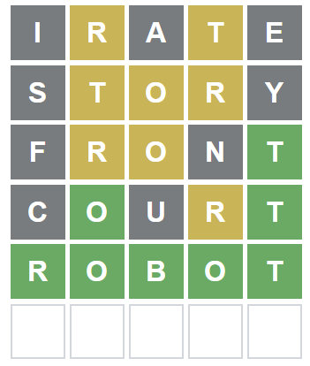
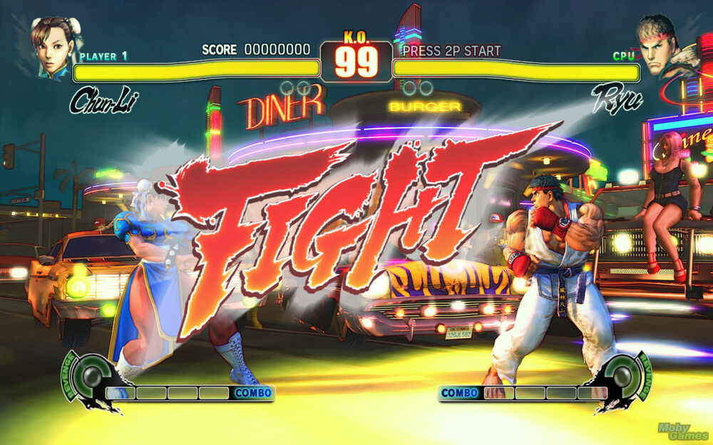

### Designing The Problem
As of January 2022 it's all Wordle, all the time in certain corners of the internet. If you are unfamiliar with the game a quick Google search will fill you in so I won't waste space here. As I mentioned in [an earlier post](https://outsiderdata.netlify.app/post/solving-the-letterboxed-puzzle-in-the-new-york-times/) I like thinking up algorithms to play games more than I like playing the games.  Many people in the R Statistics community apparently feel the same way, as Twitter has been filled with people writing their own Wordle helpers in R.

Most of these helpers come down to reducing the possible guess set to words that fit what we know from previous guesses.  Regexes of various complexity will do this for us.  Suppose we know the first letter is "c," the third is "a" and the last letter is "e," shown by green squares in the original game.  Assuming we know the word set the target word is drawn from this will tell us what the possible next guesses are.

```{r grep}

grep("^c.a.e$",wordle::wordle_solns,value = T)
```

It gets a bit more complicated when we know that some letters are in the word but we only know a position they are NOT in, shown by yellow squares in original game.  The dark magic of regex can be summoned to get any match of conditions we care to think of.

What these helpers don't do is tell you the BEST next word to try, given the constraints imposed by earlier guesses (I am speaking of the "hard" mode in the game, where the player must use the letters revealed in previous guesses for the next guess.  This is what we will be working in here). A number of intuitive schemes have been thrown out there, mostly centering on what the optimal first word is.  As it turns out getting a good first word matters an awful lot but there is an enormous amount of luck involved, too.

The most obvious strategy to to pick a first word with a lot of vowels.  To get a bit more sophisticated we might pick words with the most frequently used letters in English words of five letters.  At the next level we might think of the positions of these levels and pick words with popular letters in popular positions.  Lastly we might consider two-letter combinations, bigrams. "ES" and "LY" are very popular endings of words, for example.

We will construct algorithms to choose the most likely next best word using each of these methods.  We can then rank all possible words according to these schemes.  

When playing the game we filter the ranked word list to allow just those words on the list that conform to what our guesses have taught us about the winning word so far.  Again, we are playing only in "hard" mode here.  When playing in "not-hard" mode the strategy would be different.  It would make sense to pick a second word based on narrowing down the total solution set, a word with no letters in common to the first one.  I think hard mode is more fun.

Finally, we will play a lot of games using each method.  This is the Monte Carlo part of it.  This piece of the project will use the beautiful [Wordle package](https://github.com/coolbutuseless/wordle) written by "mikefc" aka "coolbutuseless."  I say "beautiful" because mikefc is a real programmer. As a pretend data scientist I code just enough to analyze my data.  For a data scientist there is a lot to learn about programming by careful perusal of the code in this package.

But I digress.  Using the `Wordle` package we can pit virtual players using the different strategies again the game for as many trials as we have patience for.  I just replaced my 10-year old laptop with a shiny new one so I'm feeling the need for speed!

Who is the best Wordle player?  Let's find out!

## Setup The Environment

Here are the packages we'll use.  Note we will use parallel processing where we can to speed things up. Since scoring each word is an independent task the `doFuture` package will help us out. On my 16-core processor this speeds everything up by a factor of five
For more on this see [here](https://cran.r-project.org/web/packages/doFuture/vignettes/doFuture.html).

```{r setup, message = FALSE, warning = FALSE}
library(tidyverse)
library(wordle)
library(doRNG)
library(doFuture)
library(progress)

# set up parallel session
# this will allow playing multiple games concurrently
registerDoFuture()
plan(multisession,workers = availableCores()-1)

```


### What Words?

There are many word sets out there we might use to make our choices from.  [The Natural Language Corpus Data](http://norvig.com/ngrams/) from Peter Norvig is a great centralized source for all the word lists you might want for English text analysis. In particular the first site references Donald Knuth's (yes, THAT Knuth) ["list of the 5757 five-letter words of English."](https://www-cs-faculty.stanford.edu/~knuth/sgb.html).  We could use that corpus for our puzzle solver but we won't.  As it turns out we can use the actual word list from the game. A simple inspection of the Wordle web page reveals two word lists, a short one of solutions and a longer one of acceptable guesses.  Why two lists?

[According to the creator](https://www.nytimes.com/2022/01/03/technology/wordle-word-game-creator.html), Josh Wardle, his partner, Palak Shah, complained the long list contained too many obscure words, so she chose the words she recognized to make up possible winners.  Ms. Shah is right but she may want to go over the long list again because there are many common words still in the excluded list ("belts?").

I am only interested in guessing words that might win so we will use the shorter list. Secondly, I'd rather have the computer work with a similar vocabulary as mine. Both lists are present in the `Wordle` package.


```{r get words}
words = wordle::wordle_solns
```

## Building the "Players"

### The "Naive" Strategy

The naive strategy scores all the words in the set by assigning a value to each letter based on it's frequency of occurrence in the set and sums it up.  It's worth looking at how the frequencies of letters in the winner list differs from the larger list as it suggests using the short list to score will be more profitable.  The big difference in the occurrence of "S" is interesting.  Remember the short list is a curated, not necessarily representative, sample of the larger set.

```{r letter_freq}
# use the smaller, 2315 word list from which the winners are drawn
# note the allowable guess list is much bigger
win_words <-  wordle::wordle_solns
more_words <- wordle::wordle_dict

get_letter_freq <- function(word_list=wordle_solns){
  word_list %>% 
    str_split(pattern="") %>% 
    unlist() %>% 
    enframe(value="letter") %>% 
    count(letter,name="freq") %>% 
    arrange(desc(freq))
}

letter_freq_solns <-get_letter_freq(wordle_solns) %>% 
    transmute(letter,freq = freq/length(win_words))

letter_freq_all <- get_letter_freq(wordle_dict) %>% 
  transmute(letter,freq = freq/length(more_words))

ggplot() + 
  geom_col(data=letter_freq_solns,aes(toupper(letter),freq,fill=freq)) + 
  geom_point(data=letter_freq_all,aes(toupper(letter),freq),size=2) + 
  scale_fill_distiller(palette = "Greens",
                       values = scales::rescale(1.2^(1:9)),
                       direction = 1) +
  scale_y_continuous(labels = scales::percent) +
  theme(legend.position = "none") +
  labs(title="Liklihood of Letter Appearing in a word",
       subtitle = "Bars are Set of Winners, Dots are Full Word Set",
       y="Probability That Letter Occurs in Word",
       x = "Letter")

```
Now we can score the all the words by assigning a value to each of the letters and adding it up. 

```{r naive_score}
# a function we will use for all our strategies
letter_vec <- function(string){
  unlist(str_split(string,""))
}

score_word_naive <- (function(word){
  word_vec<- unlist(str_split(word,""))
  letter_freq_solns %>% filter(letter %in% word_vec) %>% 
    tally(freq) %>% 
    pull(n)
})

# this is where the actual work happens
word_scores_naive <- foreach (word = words) %dopar%
  score_word_naive(word)

# normalize scores
word_scores_naive <-   tibble(word = words,
         naive_score = unlist(word_scores_naive)) %>% 
  mutate(naive_score = naive_score/max(naive_score) *100) %>% 
  arrange(desc(naive_score))

print(word_scores_naive[1:10,])
```

As an aside, we don't want to waste our first word with anything that has double letters so I'm happy that none of our top ten do that. Also note that some are anagrams of each other and we can consider them equivalent as starting words for this strategy. With that, we decide our five best starting words are "later," "arose," "irate," "stare," and "raise."

### The "Smart" Strategy

This is an improvement on the "naive" strategy. Here we score the possible solutions we learn from each new guess based on letter frequency in the new, smaller, solution set.  This should greatly reduce the solution set for subsequent guesses.  To see why this is so consider this artificial example.  Suppose we know that "ck" ends the word and our remaining choices are "snuck," "snack," and "block." You can see that by picking "snack" or "snuck we will either win or know the answer because we will know if an "s" appears in the word.  If we choose "block" we will either win or be left with two possible choices. "block" scores lowest using the "smart" score method.

In smaller sets there will be ties so we go to our original "naive scores" as tie breakers.

This strategy will run more slowly because we no longer have a score lookup table but have to create scores on the fly.  We could pre-compute the entire score tree but that seems like a bit much to handle.  See the "Learnings" section at the end for some others' work on this.

```{r}
score_word_smart <- function(word,word_list=wordle_solns,letter_freq=letter_freq_solns){
  word_vec<-letter_vec(word)
  score <- letter_freq %>%
    filter(letter %in% word_vec) %>% 
    tally(freq,name = word) %>% 
    unlist()
  return(score)
}

next_best_words2 <- function(next_words,break_ties=TRUE){
  letter_freq <- get_letter_freq(next_words)
  scores <- map(next_words,score_word_smart,next_words,letter_freq) %>% 
    unlist() %>% 
    enframe(name="word",value = 'score')
  if (break_ties){
    # get tiebreaker by adding the naive score to the right of the decimal point
    scores <- scores %>% 
      left_join(word_scores_naive,by="word") %>% 
      mutate(score = score + naive_score/100)
  }
    return(arrange(scores,desc(score)))
    
}
```


### The "Bigram" Strategy

I have high hopes for this one.  Certain pairs of letters are so much more likely to appear than others. For example, Without much thought we realize that "es" will form the plural of many words.  Of course that happens only at the end of words so now we will take position into account.

```{r bigram_freq}
#  tally the most popular bigrams at each position
bigram_vec <- function(string){
  vec <- letter_vec(string)
  c(paste0(vec[1:2],collapse = ""),
    paste0(vec[2:3],collapse = ""),
    paste0(vec[3:4],collapse = ""),
    paste0(vec[4:5],collapse = ""))
}

bigrams = tibble()
pos_range = 1:4
for (pos in pos_range){
    bigram = str_sub(words,pos,pos+1)
    bigrams <- bigrams %>% bind_rows(tibble(position=pos,bigram=bigram))
  }

bigram_freq <- bigrams %>% 
  group_by(position) %>% 
  count(bigram) %>% 
  mutate(probability = n/length(words)) %>% 
  select(bigram,position,probability) %>% 
  complete(position,bigram,fill=list(probability=0)) %>% 
  unique() %>% 
  arrange(position,desc(probability))

# Bigram Plot
#show top 10 at each position
bigram_freq %>% 
  group_by(position) %>% 
  mutate(bigram = toupper(bigram)) %>% 
  slice_max(probability,n=5) %>%  
  mutate(position = as.factor(position)) %>% 
  mutate(bigram = as.factor(bigram)) %>% 
  #  mutate(bigram = as.factor(as.character(bigram))) %>% 
  #  complete(position,bigram,fill=list(probability=0)) %>% 
  ggplot(aes(position,bigram,fill=probability)) + 
  geom_tile() + 
  labs(title = "Probability of Most Frequent Wordle Pairs",
       y="Letter Pair") +
  scale_fill_distiller(palette = "Greens",
                       values = scales::rescale(1.2^(1:9)),
                       direction = 1)+
  scale_x_discrete(name = "Positions",labels = c("1,2","2,3","3,4","4,5"))
```

"ER" at the end is the big winner here.  This makes "later" from the naive strategy super interesting as a start word.  "EA" is common in both the second and third positions.  "CH" is common both to start and end a word.  Remember when I discouraged the "waste" of a double letter word?  Now consider "steer" which has the most likely beginning and ending bigrams. Remember we thought that "es" was an obvious bigram? While there are 726 words in the big corpus that end in "es," there are NONE in the set of winning words! Very interesting. Now let's score the word set by bigram frequency.

```{r bigram_score}
score_word_bigram <- function(word) {
  enframe(bigram_vec(word), name = "position", value = "bigram") %>%
    left_join(bigram_freq, by = c("position", "bigram")) %>%
    tally(probability) %>%
    unlist()
}

# our parallel cluster is already set up so we can save the overhead
word_scores_bigram <- foreach (word = words) %dopar%
  score_word_bigram(word)

# normalize
word_scores_bigram <- tibble(word = words,
                             bigram_score = unlist(word_scores_bigram)) %>%
  mutate(bigram_score = bigram_score / max(bigram_score) * 100) %>%
  arrange(desc(bigram_score))
print(word_scores_bigram[1:10, ])
```

The most interesting words are "crier," "sheer," "steer," "drier," and "cheer."

It's clear that the bigram strategy has different opinions than the naive strategy. How different?

```{r score_scatter1}
left_join(word_scores_naive,word_scores_bigram, by = "word") %>% 
ggplot(aes(naive_score,bigram_score)) + 
  geom_point() + 
  labs(title = "A Big Difference of Opinion",
       subtitle = "Word Scores Using Two Different Strategies")

```
All the words containing two "e"s do well on the bigram score but terrible on the naive score.  Conversely, words like "ethos" and "eclat" (what's that?) that start with "e" have a high naive score but low bigram score.

Since there is diversity of opinion, might there be a benefit in combining the two scores?  Let's add a player that takes the average of the two scores.

```{r}
word_scores_combo <- left_join(word_scores_naive, word_scores_bigram, by="word") %>% 
  transmute(word,combo_score = naive_score+bigram_score) %>% 
  mutate(combo_score = combo_score/max(combo_score)*100) %>% 
  arrange(desc(combo_score))

print(word_scores_combo[1:10,])
```


### The Simmering Strategy

Among the people who have given thought to an optimal strategy using R is Jacob Simmering.  He [takes the Naive approach to the next level](https://jacobsimmering.com/post/wordle/) by considering the position of each letter as well.  Here is a very pretty plot from his post.  It is interesting to note where popular letters do and don't appear.  As you see from the middle panel, "a" is more often at the in the middle but seldom at the beginning or end.  "Y" is often at the end but rarely anywhere else.  Again, the my corpus is the set of winning Wordle words which differs from the Simmering one.

```{r viz_simmer, message=FALSE, warning=FALSE, echo=FALSE}

letter_matches <- vector("list", 26)
for (letter_index in 1:26) {
  letter <- letters[letter_index]
  matches <- vector("list", 5)
  for (character_index in 1:5) {
    matches[[character_index]] <- tibble(
      letter = letter,
      yellow_or_green = stringr::str_detect(words, letter),
      green = stringr::str_sub(words, 
                               character_index, 
                               character_index) == letter
    ) %>%
      mutate(
        yellow = yellow_or_green & !green
      ) %>%
      select(letter, yellow, green) %>%
      mutate(
        character_index = character_index
      )
  }
  letter_matches[[letter_index]] <- matches %>%
    bind_rows()
}

# Simmering Plot
letter_matches %>%
  bind_rows() %>%
  group_by(
    letter, character_index
  ) %>%
  summarize(
    `Yellow` = mean(yellow),
    `Green` = mean(green),
    `Green or Yellow` = mean(green | yellow),
    .groups = "drop"
  ) %>%
  gather(color, prob, -letter, -character_index) %>%
  mutate(color = forcats::fct_relevel(color, "Green or Yellow")) %>%
  ggplot(aes(x = letter, 
             y = character_index,
             fill = prob)) + 
  geom_tile() + 
  facet_grid(rows = vars(color)) + 
  labs(x = "", 
       y = "Letter Position", 
       fill = "Probability of Match") + 
  scale_fill_distiller(palette = "Spectral") + 
  theme(legend.position = "bottom")
```
In Jacob Simmering's scoring method, he weights letters appearing anywhere ("yellow") and in a known location ("green") the same.  I do a variant, "simmering_wgt" where I double the value of a "green" letter.  See Jacob's site for the code to do the scoring.  Here are the top ten words using this method.

```{r echo=FALSE, message=FALSE, warning=FALSE}
# ----------------------------------------------
naive_prob <- letter_matches %>% 
  bind_rows() %>%
  group_by(
    letter, character_index
  ) %>%
  summarize(
    yellow = mean(yellow),
    green = mean(green),
    .groups = "keep"
  )

# parallel word scoring
  word_scores_simmering <- foreach (word = words) %dopar% {
  word_score <- enframe(letter_vec(word),
                        name = "character_index",
                        value = "letter") %>% 
    left_join(naive_prob,by=c("letter","character_index")) %>% 
    summarize(yellow = sum(yellow),
              green = sum(green)
    ) %>% 
    transmute(word = word,simmering_score = yellow + green,
              simmering_wgt_score = yellow + 2 * green)
} %>% tibble(scores = .) %>% 
  unnest(scores)

  # normalize 0-100
word_scores_simmering <- word_scores_simmering %>%
  mutate(simmering_score = 
           simmering_score/max(simmering_score)*100) %>% 
  mutate(simmering_wgt_score =
           simmering_wgt_score/max(simmering_wgt_score)*100) %>% 
  arrange(desc(simmering_wgt_score))

# add to existing word scores
scored_words <- word_scores_naive %>% 
  left_join(word_scores_bigram, by = "word") %>% 
  left_join(word_scores_combo, by = "word") %>% 
  left_join(word_scores_simmering, by = "word")


word_scores_simmering[1:10,]
```
As a control group, let's add a column of random scores as a "player" as well.

```{r add_random}
scoring_methods <- as_factor(c("random","naive","smart","bigram","combo","simmer2"))

# add a column to order words randomly as a control
scored_words <- scored_words %>% 
  mutate(random_score = sample(1:nrow(scored_words),replace = FALSE))

```

### Setting Up The Game

Now we have five "players" and we can use the game engine in the `wordle` package to run repeated trials pitting each one against each other.  As a human, my average Wordle score is close to four, give or take. By the third guess it's just luck whether I hit on three or four or five.

We will iterate over each player and determine the average score, including games where the puzzle is solved too late, on the seventh try or later.  We will also count the number of times it takes more than six tries, "busts."  First we arrange the word list from best to worst for the current player.  After the player makes a guess, the game engine tells us how we've done.  We can ask the game engine for all the valid words at this point.  We match that against our ordered list of words for the player and choose the highest ranking `next_best_word()`.  Repeat until the game is solved.

### Fight!

While the machine is churning through 1000 games for each of 10 starting words for each of six methods, you could play some stirring music to make this seem exciting.  I know I am quivering with anticipation.  Go Bigram!

```{r set up games, echo=TRUE,eval=TRUE, include=TRUE}
# sort a different ranking table for each scoring method as called
arrange_scored_words <- function(scoring_method = "naive") {
  switch(
    scoring_method,
    random = arrange(scored_words, desc(random_score)),
    naive  = arrange(scored_words, desc(naive_score)),
    smart  = arrange(scored_words, desc(naive_score)),
    combo  = arrange(scored_words, desc(combo_score)),
    bigram = arrange(scored_words, desc(bigram_score)),
    # we don't use simmer1 here
    simmer1 = arrange(scored_words, desc(simmering_score)),
    simmer2 = arrange(scored_words, desc(simmering_wgt_score))
  )
}

# chose the highest ranked word that meets conditions
next_best_word <- function(words,method) {
  if (method == "smart") {
    next_word <- next_best_words2(words) %>% 
      .$word %>% 
      .[1]
  } else {
  next_word <- words_ranked %>%
    filter(word %in% words) %>%
    .$word %>%
    .[1]
  }
return(next_word)
}

# run games for each word scoring method
# WARNING: do not attempt to show the progress bar or attempts when
# running parallel process. It won't look pretty
show_prog_bar <- FALSE
show_attempts <- FALSE
# override progress bar setting if you want to see attempts
if (show_attempts) show_prog_bar = FALSE
start_word_count <- 10
num_tries <- 1000
total_games <- length(scoring_methods) * start_word_count * num_tries
if (show_prog_bar) prog_bar <- progress_bar$new(total=total_games)
start_num <- 0
results <- tibble()
```


```{r play games, echo=TRUE,eval=FALSE, include=TRUE}
play_game <- function(words_ranked,start_word,method) {
  if (show_prog_bar) prog_bar$tick()
      # initialize new game
      game <- WordleGame$new(words_ranked$word)
      player <- WordleHelper$new(nchar = 5, words_ranked$word)
      if (show_attempts) {
        player$update(start_word, game$try(start_word, quiet = FALSE))
      } else{
        player$update(start_word, game$try(start_word, quiet = TRUE))
      }
      # keep guessing
      while (!game$is_solved()) {
        next_word <-next_best_word(player$words,method)
        if (show_attempts) {
          player$update(next_word, game$try(next_word, quiet = FALSE))
        } else{
          player$update(next_word, game$try(next_word, quiet = TRUE))
        }
      }
      if (show_attempts) {
        cat("Solved in", length(game$attempts), "tries")
        print(game$attempts)
        
      }
      return(length(game$attempts))
}

# MAIN LOOP TO PLAY GAMES
registerDoRNG()
# iterate through methods
for (method in scoring_methods) {
  if (show_prog_bar)
    prog_bar$message(paste("ALGO:", method))
  else
    print(method)
  words_ranked <- arrange_scored_words(method)
  # iterate through 10 best starting words
    for (start_word in start_words) {
    # play many many games
    # Parallel multi-core method
    try_vec <- foreach (n = 1:num_tries) %dopar% {
      play_game(words_ranked, start_word,method)
    } %>%
      unlist()

    # # non-multicore version
    # try_vec <- NULL
    # for (n in 1:num_tries) {
    #   try_vec <- c(try_vec, play_game(words_ranked, start_word))
    # }
    
    results <- bind_rows(
      results,
      tibble(
        method = as_factor(method),
        start_word = start_word,
        mean_guess = mean(try_vec),
        try_vec = try_vec
      )
    )
  }
}
if (show_prog_bar) prog_bar$terminate()

results_nest <- results %>% nest(try_vec = try_vec)
# don't lose the results that took a long time to run!
#save(results_nested,file="data\mc_results.rdata")
```

```{r load results shortcut, echo=FALSE}
load("results_nest.rdata")
```

So, how did we do?
```{r display results}
results_nest %>% group_by(method) %>% 
  summarise(mean_guess=mean(mean_guess)) %>% 
  mutate(method = forcats::fct_reorder(method,mean_guess)) %>% 
  ggplot(aes(method,mean_guess,label=mean_guess))  + geom_col() + 
  geom_text(nudge_y = 0.2) + 
  labs(title = "How Many Guesses To Win, On Average?",
       subtitle = glue::glue("Monte Carlo with {num_tries} Trials
       for each of {start_word_count} Best Start Words"),
       caption = "NOTE: Lower is Better",
       y = "Mean Attempts to Win",
       x = "Word Ranking Algorithm")
```

The "smart" strategy does best but still is closer to four tries than three.  Otherwise our attempts to improve on the "naive" strategy did not bear fruit.  Bigram is scarcely better than "random." Considering frequency AND position of letters, as "simmer2" does, scores the worst.

Remember that "simmer2" weights green squares double vs. yellow ones. "Combo" ranks words on the average of "naive" and "bigram" word scores.

We can also count the fraction of tries where we "bust." taking more than six tries to find the word.

```{r}
# count busts
results_nest <- results_nest %>% group_by(method,start_word) %>% 
  mutate(busts = map(try_vec,function(x) length(x[x > 6]))) %>% 
  unnest(busts)

results_nest %>% 
  group_by(method) %>% 
  tally(busts) %>% 
  mutate(bust_pct = n/(num_tries*start_word_count)*100) %>% 
  mutate(method = forcats::fct_reorder(method,bust_pct)) %>% 
  ggplot(aes(method,bust_pct,label=paste0(bust_pct,"%")))  + geom_col() + 
  geom_text(nudge_y = 0.2) + 
  labs(title = 'How Often Do We "Bust?"',
       subtitle = glue::glue("Monte Carlo with {num_tries} Trials
       for each of {start_word_count} Best Start Words"),
       caption = "NOTE: Lower is Better",
       y = "Percent of Games Busted",
       x = "Word Ranking Algorithm")
```

There is no strategy that does not bust occasionally but it's rare.

### Learnings

It is disappointing that we can't do much better than four guesses on average. That's about what I do with my puny human brain.  Even "random" is in the running.  It suggests that there is a lot of chance in winning. After two and three guesses there is often a decent sized set of words that score equally well to use for the next guess, so it comes down to pure chance.  It is also disappointing that a sophisticated word ranking, "simmer2," performs relatively poorly.  In fact, its "bust" percentage is nearly double what the "random" method achieves.  My suspicion is that this method's affinity for words with double "e"s and/or three vowels is its downfall.  Too many vowels creates too many wasted guesses in hard mode.

There is room for improvement.  Tyler Glaiel is a professional game designer and has [written a post about his experiments](https://medium.com/@tglaiel/the-mathematically-optimal-first-guess-in-wordle-cbcb03c19b0a) in building a Wordle bot.  He achieves much better results than we do here but is using "not-hard" mode.  Eamon Mcmanus does a [fantastic overview of various approaches](https://eamonnmcmanus.blogspot.com/2022/01/solving-wordle.html) in the literature to solving the old "Mastermind" game and applies them to Wordle.  He gets similar results to Tyler.  I am curious to know how these approaches might apply to "hard" mode and how much worse their results might be. Finally, if you want to submit a `next_best_word` algo for another round, let me know.  Happy Wordling!

